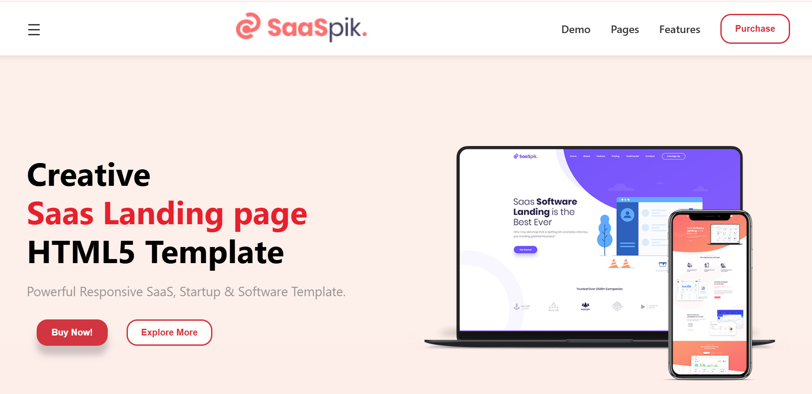

# 🚀 SaaS Landing Page

A modern, responsive SaaS landing page built using **HTML**, **CSS**, and **vanilla JavaScript**. This landing page is designed to be clean, fast, and mobile-friendly for startups and SaaS products.

## 📌 Features

- ✅ Fully responsive (desktop, tablet, mobile)
- 🎨 Clean and modern UI
- 📂 Easy to customize
- 💻 Built with HTML, CSS, and JavaScript only (no frameworks)
- 🌐 Cross-browser compatible

## 📸 Live Preview

🔗 [View Live Site](https://abbas-devloper.github.io/Saas-Landing/)

## 🛠️ Technologies Used

- HTML5
- CSS3 (Flexbox + Media Queries)
- JavaScript (Vanilla)

## 🖼️ How to Add Preview Image (if not using images folder)

Place your image directly in the root of the repo and name it:
